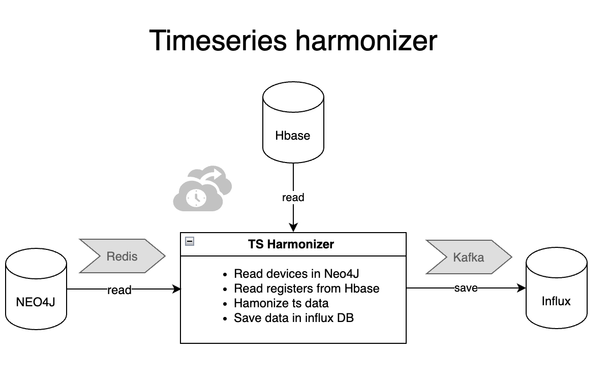

# Timeseries harmonizer

## General Process Description

The process involved in this ingestor system operate within Docker 
containers orchestrated by [Kubernetes](kubeconfigs/...). 
This process is designed to create harmonize raw data, 
apply post process and post calculations over devices.




There are three databases involved in this process:

* <u>Neo4j</u>: Neo4j provides the necessary information about the records to retrieve 
the raw data from HBase. Once the raw data is retrieved, by mapping the relationships 
and metadata within the records, Neo4j helps identify the appropriate locations in 
InfluxDB where the processed data should be saved. The harmonizer directly interacts 
with Neo4j to query and retrieve the necessary data. Once the data is fetched, 
the results are then placed into a Redis queue. This queue serves as a buffer for 
further processing, allowing the system to handle and process the data asynchronously 
in subsequent steps.


* <u>HBase</u>: HBase stores the raw, unprocessed time series data of records in its 
original form. The data is collected by ingestor processes. The process directly collects 
this raw data from HBase. The records used to retrieve the raw data are initially stored in Redis. 


* <u>InfluxDB</u>: InfluxDB is a time series database where the harmonized data is stored. 
This harmonized data is ingested into InfluxDB via a Kafka topic, with Kafka acting as
a distributed messaging platform that enables real-time data streaming


There are three different main processes related with timeseries_harmonizer:
### Raw data to harmonized data

The process starts by retrieving raw data from the 
HBase database for each source, followed by data cleaning. Three primary cleaning 
methods are used to ensure the data is accurate and usable (detailed above).
After cleaning, conversion factors are applied to standardize the data types 
and units of measurement, ensuring uniformity across the dataset. Then, the processed data 
is transmitted via Kafka, a distributed messaging platform, to ensure 
efficient real-time data transfer. Finally, the cleaned and converted data 
is stored in InfluxDB, a time-series database, where it can be queried 
and analyzed for further insights. 

The cleaning method used is specifically defined for each source to adapt to the particularities of each.

These cleaning methods are:
- **Z-Score Normalization for Outlier Detection**
  - **Purpose**: This method detects and handles outliers in the dataset by measuring how far 
  each data point deviates from the mean. Outliers are data points that are significantly 
  different from the majority of the data, and removing them ensures the integrity of the analysis.
  - **Steps**:
    1. **Check aggregation function**: If the aggregation function is set to `"LAST"`, 
    the function skips the cleaning process and returns the data without any modifications.
    2. **Percentile Cleaning**: For other data, the function cleans a DataFrame by identifying and removing 
    outlier values using the 1st and 99th percentiles. It first calculates the interquartile range (IQR) 
    as the difference between these percentiles, then sets the upper and lower bounds based on this range. 
    Any values outside these bounds are considered outliers and are replaced with `nan`.
    3. **Rolling Window Approach**: For each value in the DataFrame, a sliding window is
    taken from previous data points, and the mean and standard deviation of this window are calculated. 
    Then, the Z-score for each value is computed, measuring how many standard deviations it is away from 
    the window's mean. If the Z-score exceeds 8, the value is considered an outlier and is replaced with `nan`.
    This process helps clean the data by removing values that deviate significantly from the overall trend.
    5. **Clean Data**: The outliers are removed, and the remaining data is returned with a more consistent 
    and reliable range of values.

  - **Use Case**: This method is applied in <u>bacnet</u> devices


- **Energy Data Cleaning for Instantaneous Measurements**

  - **Purpose**: This method is tailored for energy metrics such as generation, export, consumption, and grid imports. 
  It focuses on ensuring that energy readings are physically meaningful and cleaning any anomalies like negative values 
  or night consumption.

  - **Steps**:
    1. **Check relevant device type**: checks if the type of the device is one of "Generation", 
    "ExportedToGrid", or "ImportedFromGrid". If it matches proceeds with cleaning these values, 
    if not a Z-score Normalization is applied.
    2. **Max Power Fallback**: If the maximum power is not provided, a fallback value of 10.000.
    3. **Max Power Clean**: ensures that energy data does not exceed the defined maximum power limits. It checks 
    the difference between consecutive data points and calculates the time difference between them. Using these values, 
    the function applies a maximum power constraint, replacing any data points that exceed the acceptable power range 
    with `nan`.
    4. **Night Consumption Clean**: function removes or adjusts energy consumption data that occurs during nighttime 
    hours, typically between 11:00 PM and 6:00 AM, when energy generation or export should not be recorded. It identifies
    these nighttime entries and processes them differently based on whether the data is accumulated or not. If the data 
    is accumulated, it temporarily replaces missing values with a placeholder and removes the nighttime values. If the 
    data is not accumulated, it sets nighttime values to zero. It is just applied to "Generation" and "ExportedToGrid" 
    devices types.
  
  - **Use Case**: This method is applied in <u>dexma</u> devices


- **Energy Data Cleaning for Accumulated Measurements**

  - **Purpose**: This method is used for cleaning accumulated energy data (e.g., total energy generated, exported, or 
      imported over time). It ensures the validity of incremental energy readings and handles extreme values.

  - **Steps**:

    1. **Check relevant device type**: checks if the type of the device is one of "Generation", 
    "ExportedToGrid", or "ImportedFromGrid". If it matches proceeds with cleaning these accumulated energy values, 
    if not a Z-score Normalization is applied.
    2. **Max Power Fallback**: If the maximum power is not provided, a fallback value of 10.000.
    3. **Incremental Cleaning**: function ensures that energy data follows an incremental pattern, where each value is
    greater than or equal to the previous one. It removes any data points that violate this rule, helping maintain the 
    consistency and integrity of the accumulated energy data.
    4. **Percentile-based Cleaning**: Extreme values are removed based on percentiles, ensuring that any outlier data 
    points are cleaned out for a more accurate dataset.
    5. **Percentile Cleaning**: For other data, the function cleans a DataFrame by identifying and removing 
    outlier values using the 1st and 99th percentiles. It first calculates the interquartile range (IQR) 
    as the difference between these percentiles, then sets the upper and lower bounds based on this range. 
    Any values outside these bounds are considered outliers and are replaced with `nan`.
    6. **Max Power Clean**: ensures that energy data does not exceed the defined maximum power limits. It checks 
    the difference between consecutive data points and calculates the time difference between them. Using these values, 
    the function applies a maximum power constraint, replacing any data points that exceed the acceptable power range 
    with `nan`. This part is only applied to "Generation" and "ExportedToGrid" devices types.
    7. **Night Consumption Clean**: function removes or adjusts energy consumption data that occurs during nighttime 
    hours, typically between 11:00 PM and 6:00 AM, when energy generation or export should not be recorded. It identifies
    these nighttime entries and processes them differently based on whether the data is accumulated or not. If the data 
    is accumulated, it temporarily replaces missing values with a placeholder and removes the nighttime values. If the 
    data is not accumulated, it sets nighttime values to zero. It is just applied to "Generation" and "ExportedToGrid" 
    devices types.
  
  - **Use Case**: This method is applied in <u>modbus</u> devices

The other sources such as: agbar, ixon, manttest, ixon, manntest and meteogalicia do not need a cleaning.

There is also a priority list for the sources, such that the next source in the list will 
overwrite the previous one. This means that when multiple sources are involved, the 
system processes them in a prioritized order, and if a newer source has higher 
priority, it will replace the data from the previous source. This list of priority from lower 
to higher is: `[dexma, meteogalicia, modbus, bacnet, agbar, ixon, manttest]`


### Post processes

In photovoltaic systems, generation and export data may not align perfectly. This process ensures the export 
value never exceeds generation by adjusting the export data and redistributing any excess to nearby points, 
maintaining realistic and consistent data.

- **Steps**:
  1. **Generation and Exported TimeSeries**: It retrieves the time-series data for generation 
  and exported data from the InfluxDB database.
  2. **Data adjustment**: This function processes the generation and exported data to correct 
  any inconsistencies where the exported value exceeds the generation value. If any issues are 
  found, it adjusts the export values to match generation levels. It checks for over-exported 
  values, and when found, it redistributes the excess export across adjacent records to balance
  the export values. Ensures that the exported values remain consistent with the generation values.
  3. **Update data**: If any modification have been made to Exported data, it is updated in InfluxDB.


### Post calculations
This process performs calculations based on a given formula and prepares the results for further use.
- **Steps**:
  1. **Prepare the Formula**: Extract the formula for calculation from the device data and wrap it 
  in XML tags. This XML structure is then parsed to create an XML tree for further processing.
  2. **Calculate the Formula**: Processes the formula handling different types of nodes such as constants,
  variables, operations, and functions. Returns the final calculated result after all operations and 
  functions have been applied.
  3. **Store Data**: The processed data is harmonized into the required format for Influx and sent to 
  Kafka for further storage 


### Compliance
Some harmonized devices have specified limits that allow for the calculation of their compliance. 
In such cases, this process generates the time series for that compliances.
- **Steps**:
  1. **Limits Values**: Each device has both an upper and a lower limit. Each limit is defined by 
  two formulas: an activation formula, which determines when the limit is active, and a calculation 
  formula, which provides the actual limit value. Using these two properties, a time series is 
  generated for the upper limit, and another one for the lower limit.
  2. **Harmonized Ts**: The time series to be evaluated is retrieved from the Influx database.
  3. **Compliance calculation**: With the previously gathered data, compliance can now be calculated. 
  In this step, it is evaluated whether the harmonized data falls between the upper and lower limits 
  at each time instant. A new time series is then generated and stored, associated with the Compliance 
  Key Performance Indicator (KPI) hash.


## Using Dockerfiles for Deployments in Kubernetes
Kubernetes is the go-to platform for orchestrating containerized applications. However, to efficiently deploy and manage these applications within a Kubernetes cluster, it's essential to package them in a way that is portable, consistent, and scalable. This is where Dockerfiles and container images come into play.

### Dockerfile 
A **Dockerfile** is a blueprint that defines how to build a Docker image, which is a lightweight, stand-alone package containing all the necessary components for an application to run, including the code, runtime, libraries, and dependencies. Docker images provide several key advantages in a Kubernetes
The components of the Dockerfile for this project are as follows:

**1. Base image:**

The Dockerfile starts by specifying a base image, which serves as the foundational layer for the container. It typically includes the operating system and basic dependencies.
```bash
    FROM python:3.10-slim
```
In this case, the base image is Python 3.10 (slim version), which provides a lightweight environment to run the application.

**2. Set working directory:**

The Dockerfile specifies a working directory within the container where the application files will be stored and executed.
```bash
  WORKDIR /harmonizer
```
By setting a working directory, the container knows where to look for files and where commands should be executed.

**3. Update Package List:**

To ensure the container has access to the latest package versions, the Dockerfile includes a command to refresh the local cache of available packages.
```bash
  RUN apt-get update
```

**4. Install system packages:**

The next step is to install any system-level dependencies required for the application. In this project, the Dockerfile installs several essential packages:

```bash
  RUN apt-get install -y git
  RUN apt-get install -y gcc
```
These packages are necessary for tasks such as compiling code, managing processes, and establishing VPN connections.

**5. Add requirements.txt file and install dependencies**

The Dockerfile includes a step to copy the requirements.txt file (which lists the application's Python dependencies) into the container and install those dependencies using pip.
```bash
  COPY requirements.txt requirements.txt
  RUN pip install -r requirements.txt
```
This ensures that all the required Python packages are available inside the container.

**6. Add the project files from local into the Docker container**

The Dockerfile then copies the project files from the local machine into the container. This step includes all the necessary application code and configuration files.
```bash
  COPY . .
```
**7. Storing the Image in Harbor**

Once the Docker image is built, it needs to be stored in a container registry to be accessible by Kubernetes for deployment. Harbor is a popular tool for securely storing and managing container images.
The following command can be used to build the image and push it to Harbor:

`
 docker buildx build --platform linux/amd64,linux/arm64 --push -t 1l41bgc7.c1.gra9.container-registry.ovh.net/infraestructures/harmonizer:prod .
`
This command:
- Uses Buildx to build the image for multiple architectures (linux/amd64 and linux/arm64).
- Pushes the image to the Harbor registry.
- Tags the image as bacnet_ingestor:prod, which can be referenced in Kubernetes deployments.


<!--
# HARMONIZER

## Dexma

 - Raw data is gathered from hbase
 - Harmonizing process:
   - Obtain the property related to each device from neo4j database
   - Save data related to property into Druid database

## Modbus

 - Raw data is gathered from hbase (last seven days data) 
 - Harmonizing process:
   - Obtain the property related to each device from neo4j database
   - Normalize the data
   - Clean empty registers
   - Save data related to property into Druid database

## Mattest indicators 
 - Raw data is gathered from hbase (Last 180 days) 
 - Harmonizing process (launch every Months):
    - 

## KPIs

KPIs calculation: 
- EnergyConsumptionElectricitySelfConsumption: Difference between generated energy and exported energy 
- EnergyConsumptionElectricity: Difference between self consumption and imported energy
- CO2Emissions: Generated energy multiplied by a conversion factor
- TreesEquivalent: Generated energy multiplied by a conversion factor
- HouseholdsEquivalent: Generated energy multiplied by a conversion factor


-->

